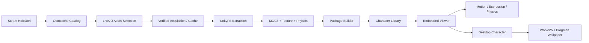

# HoloDori Live2D Manager (HDM)

> **HoloDori Live2D Manager (HDM)** is an unofficial Windows desktop application for discovering and importing Live2D resources from a locally installed HoloDori game, building validated Cubism model packages, and viewing them directly inside an embedded Live2D player.
>
> HDM supports model and outfit libraries, real game motions and expressions, authentic Live2D physics, parameter inspection, desktop-character mode, and Windows wallpaper hosting. The complete workflow runs locally and does not bundle HoloDori game assets or the proprietary Live2D Cubism Core.
>
> The project is built with **Rust + Tauri 2 + React + TypeScript + WebGL**, with a safety-oriented importer architecture, content-integrity checks, caching, runtime validation, and Windows desktop integration.

> [!IMPORTANT]
> **Unofficial project.** HDM is not affiliated with or endorsed by HoloDori, COVER Corp., hololive production, or Live2D Inc. Users are responsible for complying with the licenses and terms applicable to software and content they use with HDM.

[](https://github.com/loliRuriruri/HoloDori/actions)
[](https://microsoft.com/windows)
[](https://v2.tauri.app)
[](docs/ACCEPTANCE.md)

---

## Table of Contents

- [What is HDM?](#what-is-hdm)
- [Main Features](#main-features)
- [How It Works](#how-it-works)
- [Project Architecture](#project-architecture)
- [Quick Start](#quick-start)
- [Requirements](#requirements)
- [Character Player](#character-player)
- [Desktop Character Window](#desktop-character-window)
- [True Windows Wallpaper Mode](#true-windows-wallpaper-mode)
- [Import Pipeline](#import-pipeline)
- [Validation & Tests](#validation--tests)
- [Documentation](#documentation)
- [Limitations](#limitations)
- [Legal & Third-Party Components](#legal--third-party-components)
- [Development](#development)
- [Project Status](#project-status)

---

## What is HDM?

HoloDori Live2D Manager is an end-to-end local conversion utility and interactive character player designed for fans and creators who legally own **hololive Dreams** on Steam.

Instead of manual asset extraction, reverse-engineering, or fragile script work, HDM provides an integrated graphical interface that automatically locates your Steam installation, verifies file integrity, decodes the game's encrypted asset catalog, extracts authentic Live2D MOC3 models, high-resolution textures, physics rigs, motions, and expressions, and constructs standardized, runtime-compliant Cubism packages (`.model3.json`).

Once packaged, models can be previewed in the embedded WebGL viewer, pinned to your desktop as a transparent, interactive desktop mascot, or reparented directly into the Windows desktop hierarchy as a true live wallpaper positioned seamlessly behind your desktop icons.

---

## Main Features

### 1. Source Importer
- **Steam Auto-Detection**: Discovers the game installation and `octocacheevai` database automatically from standard Steam libraries and VDF configurations.
- **Octocache Decryption & Parsing**: Deobfuscates and decodes the AES-128-CBC encrypted asset bundle catalog.
- **Catalog Navigation**: Browses characters, outfits, motions, and expressions directly from catalog metadata.
- **Verified Acquisition & Cache**: Fetches assets with strict size and MD5 checksum validation, atomic file swapping, and local offline cache reuse.

### 2. Live2D Package Builder
- **Asset Extraction**: Unpacks UnityFS archives to extract pure `.moc3` binary definitions, Texture2D atlases, and raw animation clips.
- **Authentic Physics Reconstruction**: Recovers authentic Cubism physics definitions (`physics3.json`) with input/output parameter mappings, gravity, and normalization.
- **Standardized Manifests**: Generates compliant `.model3.json` manifests compatible with standard Cubism SDK tools and runtimes.
- **Multi-Stage Validation**: Enforces Level 1 (Container Check), Level 2 (Structural Package Integrity), and Level 3 (Runtime Evaluation) verification.

### 3. Embedded Live2D Viewer
- **Official Cubism Web SDK Integration**: Direct WebGL rendering utilizing official Live2D Cubism Web Core standards.
- **Authentic Motions & Expressions**: Plays genuine in-game motions, transitions, and facial expressions with smooth blending.
- **Real-Time Physics Evaluation**: Authentic hair, accessory, and clothing physics responding to model movement.
- **Procedural Eye Blink & Breathing**: Natural idle behavior blended with motion playback.
- **Camera Pan, Zoom & Fit**: Responsive controls supporting smooth panning, mouse-wheel zooming, and automatic letterboxed viewport fitting.
- **Parameter Inspector & Overrides**: Real-time slider inspection and manual overrides for all Live2D parameters.

### 4. Character Player
- **Random & Auto Motion**: Background idle cycling with customizable delays and non-repeating random selection.
- **Favorites & Recents**: Fast access to favorite outfits, expressions, and recently viewed models.
- **State Persistence**: Saves zoom, background, framerate, and playback preferences across restarts.
- **Fullscreen Presentation**: Clean distraction-free view with toggleable interface.

### 5. Desktop Character Mode
- **Transparent Frameless Window**: Dedicated borderless secondary window rendering the Live2D canvas with per-pixel alpha transparency.
- **Always-on-Top & Click-Through**: Allows the character to float above all windows or ignore mouse input (`WS_EX_TRANSPARENT`) for uninterrupted desktop work.
- **System Tray Controls**: Quick access to toggle interactive mode, pause animation, switch characters, or hide to tray.
- **Multi-Monitor & DPI Safety**: Automatically clamps positions across multi-monitor setups to prevent off-screen loss.
- **Framerate Throttling**: Switch between 30 FPS (battery-saver) and 60 FPS (smooth animation).

### 6. True Windows Wallpaper Mode
- **Native Explorer Reparenting**: Reparents the Live2D window into the Windows shell (`WorkerW` or `Progman`) behind desktop icons using native Win32 APIs.
- **Desktop Icon Invariant**: Desktop icons, shortcuts, selection rectangles, and mouse clicks remain 100% responsive (`SHELLDLL_DefView` is never modified or hidden).
- **Infallible Fallback**: Automatically falls back to Desktop Character Overlay if Explorer internals change or reparenting fails.
- **Host Recovery Watchdog**: Automatically polls host HWND validity and recovers seamlessly if `explorer.exe` restarts.

---

## How It Works

HDM bridges the gap between UnityFS game assets and the standard Live2D Cubism ecosystem:



1. **Discovery**: HDM reads the local Steam configuration to identify the game path and locates the encrypted `octocacheevai` catalog.
2. **Catalog Indexing**: The catalog is decrypted in-memory using AES-128-CBC, indexing all `live2d_mdl_*`, `live2d_mot_*`, and `live2d_exp_*` bundles.
3. **Extraction & Packaging**: Selected assets are extracted, verified, and assembled into standard `.model3.json` directories on disk.
4. **Presentation**: The WebGL viewer renders the model using Cubism Core, offering interactive playback, desktop overlay, or live wallpaper hosting.

---

## Quick Start

### 1. Prerequisites
- Windows 10 (64-bit) or Windows 11 (21H2, 22H2, 23H2, 24H2, 25H2)
- Steam installation with **hololive Dreams** installed locally
- Official Live2D Cubism Core JS binary (see below)

### 2. Configure Cubism Core
In compliance with Live2D Inc.'s proprietary licensing, the proprietary Cubism Core binary is **not bundled** in this repository.

1. Download the official **Cubism SDK for Web** from the [Live2D Official Website](https://www.live2d.com/en/sdk/about-web/).
2. Extract `live2dcubismcore.min.js` (found under `Core/live2dcubismcore.min.js`).
3. Place it in the application's public assets folder:
   ```
   public/live2d/live2dcubismcore.min.js
   ```

### 3. Launching
Run the pre-compiled binary or build from source:
```powershell
# Run development mode
npm install
npm run tauri dev
```

---

## Character Player

The embedded Character Player provides an authentic presentation view for HoloDori models:

- **Character & Outfit Navigation**: Switch between idol models (`001=nrml`, `002=uniq`, `003=cmmn`, `004=uniq`) seamlessly on the same WebGL canvas.
- **Authentic Motion Library**: Play character-specific game motions (greeting, idle, dance, performance) with smooth transition blending.
- **Expression Palette**: Apply facial expressions (smiles, blushes, surprises, winks) with neutral reset capability.
- **Physics Rigging**: Natural hair and clothing physics evaluated in real time through official Cubism Physics algorithms.
- **Parameter Inspector**: Inspect all model parameters (Angle X/Y/Z, Eye Open, Mouth Form) with manual slider overrides.

---

## Desktop Character Window

HDM allows you to detach your character from the main window and display them directly on your Windows desktop:

- **One-Click Send to Desktop**: Click "Send to Desktop" in the viewer to spawn a borderless transparent mascot window.
- **Edit & Lock Mode**: In Edit Mode, drag the character to any position on your desktop or resize using the corner handles. Toggle Lock Mode to secure the placement.
- **Click-Through Mode**: Enable OS-level click-through (`WS_EX_TRANSPARENT`) so clicks pass straight through to whatever application is behind the character.
- **System Tray Management**: The application lives in your system tray, offering quick toggles for pause, click-through, always-on-top, and character switching.

---

## True Windows Wallpaper Mode

HDM includes native support for Windows Wallpaper Mode, embedding the character into your desktop shell:

```
Desktop Window Hierarchy (Windows 11 24H2 / 25H2):
├── Progman (0x00010152)
│   ├── SHELLDLL_DefView (0x00010156)  [Desktop Icons & ListView]
│   └── WorkerW (0x00792176)           [Wallpaper Background Host]
│       └── HDM Live2D Window          [Reparented behind icons]
```

- **Behind Desktop Icons**: The character renders behind your desktop shortcuts and icons. You can click, select, and organize desktop icons normally without interference.
- **Modern Windows 11 & Legacy Windows 10**: Automatically detects `ModernWin11ChildWorkerW`, `LegacyWin10SiblingWorkerW`, and `ProgmanDirect` topologies.
- **Explorer Watchdog**: If Windows Explorer crashes or restarts, the background watchdog detects the invalidated handle and automatically recovers within 2.5 seconds.
- **Infallible Fallback**: If shell reparenting is unsupported on your specific environment, HDM automatically engages Desktop Overlay mode so you never lose character visibility.

---

## Import Pipeline

The core conversion engine is written in safe Rust:

| Stage | Responsibility | Safeguards |
|---|---|---|
| **Detection** | Identifies Steam library locations from `libraryfolders.vdf`. | Resolves unicode, whitespace, and alternate library drives. |
| **Catalog Decryption** | Decrypts `octocacheevai` binary header and asset list. | AES-128-CBC PKCS7 validation with SHA-256 integrity verification. |
| **Asset Acquisition** | Streams asset bundles from cache or verified local CDN. | Size verification + MD5 checksum matching before storage. |
| **Archive Unpacking** | Decodes UnityFS format via `unity-rs-core`. | Strips Unity container headers to isolate raw MOC3 and PNG streams. |
| **Manifest Assembly** | Generates standardized `.model3.json` and `.physics3.json`. | Relative path confinement preventing directory traversal. |
| **Library Catalog** | Indexes local packages by character ID and outfit ID. | Strict duplicate deduplication and atomic index persistence. |

---

## Validation & Tests

HDM is covered by an automated test suite verifying every component from Rust backend to WebGL rendering:

```powershell
# Run backend test suite (84 tests)
cargo test --workspace -- --test-threads=1

# Run frontend unit tests (17 tests) & browser WebGL acceptance (14 tests)
npm test

# Run live Win32 wallpaper acceptance suite (11 gates)
cargo run --release --example verify_wallpaper_live
```

- **Backend (Rust)**: 84 automated tests covering octocache decryption, catalog loading, UnityFS unpacking, path sanitization, multi-monitor clamping, and wallpaper state machines.
- **Frontend (Node/Playwright)**: 17 unit tests verifying parameter grouping, zoom clamping, settings migration, and fallback priority.
- **Browser Runtime**: 14 headless WebGL acceptance tests validating repeated 20-cycle load/unload stress, real motion playback, expression transitions, physics attachments, and framerate throttling.
- **Win32 Runtime**: 11 live acceptance gates verifying WorkerW attachment, 20 native attach/detach cycles, Explorer restart recovery, and DPI scaling.

Full details and historical gates are documented in [docs/ACCEPTANCE.md](docs/ACCEPTANCE.md).

---

## Documentation

Comprehensive technical documentation is available in the [`docs/`](docs/) directory:

- [**Documentation Portal (Korean Wiki)**](docs/INDEX.md) — Comprehensive guide and wiki-style reference.
- [**System Architecture**](docs/ARCHITECTURE.md) — Multi-tier architecture, IPC communication, and subsystem breakdown.
- [**Wallpaper Mode Guide**](docs/WALLPAPER_MODE.md) — Native Win32 wallpaper hosting, hierarchy discovery, and watchdog details.
- [**Windows Shell Host Audit**](docs/WINDOWS_WALLPAPER_HOST_AUDIT.md) — In-depth technical spike on Windows 11 Progman and WorkerW internals.
- [**Desktop Character Guide**](docs/DESKTOP_CHARACTER.md) — Frameless transparent desktop window architecture.
- [**Character Player Guide**](docs/CHARACTER_PLAYER.md) — Embedded player, auto-motion, and favorites persistence.
- [**Motion & Expression Integration**](docs/MOTION_EXPRESSION.md) — HoloDori motion formats, curves, and expression layering.
- [**Octocache & Importer Audit**](docs/IMPORTER_AUDIT.md) — Binary reverse-engineering and catalog format notes.
- [**Third-Party Review**](docs/THIRD_PARTY_REVIEW.md) — Component boundaries, licenses, and legal separation.

---

## Limitations

- **Windows Only**: True Wallpaper Mode and Desktop Character features rely directly on the Win32 API (`user32.dll`, `gdi32.dll`). macOS and Linux are not supported for desktop/wallpaper modes.
- **Cubism Core Required**: The proprietary Live2D Cubism Core JS binary must be supplied locally by the user.
- **Game Installation Required**: Authentic models, textures, motions, and expressions are not distributed with HDM and require a local Steam installation of hololive Dreams.

---

## Legal & Third-Party Components

- **Project License**: No repository-wide open-source license has been declared yet. Third-party components remain subject to their respective licenses.
- **hololive Dreams / HoloDori**: Intellectual property and assets belong to **COVER Corp.** and their respective creators. This project does not distribute any copyrighted game assets.
- **Live2D / Cubism**: Live2D® and Cubism® are registered trademarks of **Live2D Inc.** This project uses the official Live2D Cubism SDK for Web in accordance with Live2D's terms and does not redistribute proprietary core binaries.

---

## Development

```powershell
# Clone the repository
git clone https://github.com/loliRuriruri/HoloDori.git
cd HoloDori

# Install frontend dependencies
npm install

# Build frontend
npm run build

# Run application in development mode
npm run tauri dev

# Build production binary
npx tauri build --no-bundle
```

---

## Project Status

- **HDM.AGENT.1**: Core Conversion Engine & MOC3 Extraction — **PASSED**
- **HDM.AGENT.2**: Character Library & Multi-Model Batching — **PASSED**
- **HDM.AGENT.3**: Integrated HoloDori Importer & Steam Auto-Discovery — **PASSED**
- **HDM.AGENT.4**: Embedded WebGL Cubism Player, Motions, Expressions & Physics — **PASSED**
- **HDM.AGENT.5A**: Transparent Desktop Character Mascot Window — **PASSED**
- **HDM.AGENT.5B / 5B-R**: True Windows Wallpaper Mode & Runtime Acceptance — **PASSED**
- **HDM.PUBLICATION**: Public Release, Wiki Documentation & CI — **ACTIVE**
