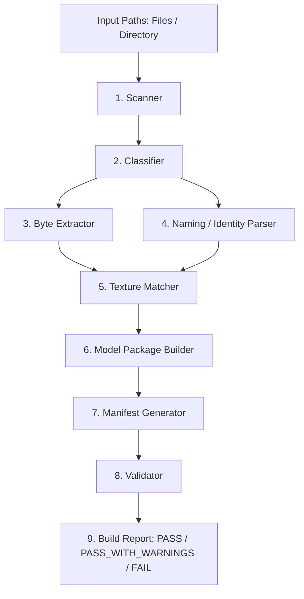

# HoloDori Live2D Manager — Architecture Document

## 1. Overview and Mission

`HoloDori Live2D Manager` is a dedicated Windows desktop application built with **Tauri 2**, **React**, **TypeScript**, and **Rust**.

### Primary Mission
To convert locally supplied/extracted hololive Dreams Live2D resource files into valid, fully-formed runtime Live2D Cubism model packages.

### Strict Boundary with Live2DRecovery
- **HoloDori Live2D Manager**: `Game/extracted resources → Runnable Live2D Cubism runtime package (.moc3 + textures + .model3.json)`
- **Live2DRecovery**: `Binary MOC3 → Editable CMO3 Cubism Editor project reconstruction`
- These two projects have strictly separated responsibilities. HoloDori Live2D Manager does not attempt CMO3 reverse-engineering.

### No Python Runtime Dependency
The conversion engine is implemented 100% in Rust. End users do not need Python, Node.js, VS Code, or command-line tooling to run the packaged desktop application.

---

## 2. Core Architecture and Separation of Concerns

The architecture strictly enforces separation between the user interface and domain logic:

```
src-tauri/src/
├── main.rs                 # Tauri entry point / runner
├── lib.rs                  # Library entry point & command registrations
├── commands/               # Tauri IPC command handlers (thin adapters)
│   ├── mod.rs
│   ├── scan.rs             # Scan directories or files
│   ├── build.rs            # Execute package builds
│   └── config.rs           # Configuration and rules queries
└── domain/                 # Pure domain logic (decoupled from Tauri/GUI)
    ├── mod.rs
    ├── types.rs            # Strongly typed domain structs and enums
    ├── error.rs            # Structured errors with error codes
    ├── scanner/            # Safe file & recursive directory discovery
    ├── classifier/         # Structural candidate classification
    ├── extractor/          # Safe recursive _bytes parsing & extraction
    ├── parser/             # Deterministic 5-digit/3-digit identity parsing
    ├── matcher/            # Multi-evidence texture association
    ├── manifest/           # Live2D Cubism model3.json generator
    ├── builder/            # Output packaging & atomic collision handling
    ├── validator/          # 10-stage integrity and relative reference validation
    └── library/            # Library management, metadata cache, batch build manager
        ├── mod.rs          # CharacterLibrary & OutfitEntry deterministic grouping
        ├── cache.rs        # Lightweight scan metadata cache (LibraryScanCache)
        └── batch.rs        # BatchBuildManager with cancellation & progress events
```

### Decoupled Engine
The domain crate does not depend on Tauri state or window management. Any future CLI tool can link directly against the domain crate and execute identical batch conversion pipelines.

---

## 3. Data Pipeline Stages

Every stage has strongly typed inputs and outputs:



### Stage 1: Scanner (`domain::scanner`)
- **Input**: List of filesystem paths (individual files, directories, recursive flag).
- **Behavior**: Traverses directories safely without following recursive symlink loops or escaping root. Reads metadata only.
- **Output**: `ScanResult { candidate_files: Vec<ScannedFile> }`

### Stage 2: Classifier (`domain::classifier`)
- **Input**: `ScannedFile`
- **Behavior**: Inspects file extension and structure. Classifies into:
  - `ModelResourceJsonCandidate`: JSON file with candidate `_bytes` payload.
  - `TextureCandidate`: PNG image file.
  - `RawMocCandidate`: Direct `.moc3` binary file.
  - `IgnoredFile`: Unrelated or non-conforming file.
- **Output**: `ClassifiedPool`

### Stage 3: Byte Extractor (`domain::extractor`)
- **Input**: Model resource JSON path.
- **Behavior**:
  - Safely parses JSON with size limits (default 500MB safety bound).
  - Recursively locates `_bytes` integer array candidate(s).
  - Validates all values are in `0..=255`. Rejects negatives, floats, strings, overflows.
  - Writes extracted bytes to a secure temporary file first.
  - Validates MOC3 candidate header (`MOC3` magic bytes, Cubism version byte 3, 4, or 5).
  - Never overwrites source file.
- **Output**: `ExtractedMoc { temp_path, byte_count, version, sha256 }`

### Stage 4: Naming / Identity Parser (`domain::parser`)
- **Input**: Filename / stem string.
- **Behavior**:
  - Deterministic regex and rule parser:
    - 5-digit Character ID (e.g. `12345`)
    - 3-digit Outfit ID (e.g. `001`)
    - Configurable style mapping: `001` -> `nrml`, `002` -> `cmmn`, `003` -> `uniq`.
    - Outfit `004` marked unconfirmed style, requiring explicit observation.
  - Returns `IdentityResult` with confidence score (`Exact`, `High`, `Ambiguous`, `None`) and textual evidence.
- **Output**: `ParsedIdentity`

### Stage 5: Texture Matcher (`domain::matcher`)
- **Input**: `ExtractedMoc` or raw MOC + pool of `TextureCandidate`.
- **Behavior**:
  - Evaluates 5 evidence vectors:
    1. Character ID match
    2. Outfit ID match
    3. Style tag match (`nrml`, `cmmn`, `uniq`)
    4. Common filename stem
    5. Directory proximity / relative path closeness
  - Output confidence: `Exact`, `High`, `Ambiguous`, `NoMatch`.
  - **Zero Silent Guessing**: Ambiguous candidates halt automatic building for that model and report all candidate choices to the user.
- **Output**: `MatchedModelGroup`

### Stage 6: Model Package Builder (`domain::builder`)
- **Input**: `MatchedModelGroup`, output destination directory, conflict policy.
- **Conflict Policies**:
  - `Skip`: Do not overwrite existing directory.
  - `UniqueSuffix`: Create `_1`, `_2`, etc.
  - `Overwrite`: Replace only upon explicit user confirmation.
- **Default Package Structure**:
  ```
  output/
    <character>_<outfit>/
      <character>_<outfit>.moc3
      <character>_<outfit>.model3.json
      textures/
        texture_00.png
  ```
- **Output**: `StagedPackage`

### Stage 7: Manifest Generator (`domain::manifest`)
- **Input**: Package file layout.
- **Behavior**:
  - Generates official Live2D Cubism `model3.json` (Specification Version 3).
  - Emits ONLY relative paths (`character_outfit.moc3`, `textures/texture_00.png`).
  - Never emits absolute Windows paths.
  - Never invents non-existent resource references (Physics, Pose, Motions, Expressions are excluded unless verified present).
- **Output**: Formatted `.model3.json`

### Stage 8: Validator (`domain::validator`)
- **Input**: `StagedPackage`
- **10 Validation Checks**:
  1. Source JSON parses.
  2. `_bytes` extraction succeeded without truncation.
  3. Generated binary is non-empty and has valid MOC3 magic header.
  4. Output MOC3 file exists on disk.
  5. All referenced texture files exist on disk.
  6. `model3.json` parses as valid JSON matching Cubism schema.
  7. Every file reference in `model3.json` resolves relative to the manifest directory.
  8. No referenced path escapes the model directory (traversal defense).
  9. Package can be re-opened and parsed by independent verification pass.
  10. Source files remain bit-for-bit unchanged (hash verification).
- **Output**: `ValidationReport`

### Stage 9: Build Report (`domain::types`)
- Emits final status: `PASS`, `PASS_WITH_WARNINGS`, or `FAIL`.
- Full audit log of input files, output files, matching evidence, validation stages, and structured error codes.

---

## 4. Security and Reliability Standards

1. **Untrusted Input Handling**: Files are treated as potentially malicious or malformed.
2. **Bounds Checking & Limits**: File size caps prevent out-of-memory denial of service.
3. **No Dynamic Execution**: No shell construction, no command execution, no Python subprocesses.
4. **Path Traversal Defense**: All input and output paths are sanitized; relative references must not contain `..` or resolve outside the destination container.
5. **Atomic Operations**: Files are written to temporary staging locations and atomically moved/renamed.
6. **Fault Isolation**: A corrupted or unmatchable model resource fails gracefully with a structured error and does NOT abort other models in the batch.

---

## 5. Subsystem Status & Roadmap
- **Phase 1 (Core Pipeline)**: COMPLETED.
- **Phase 2 (Library & Batch Manager)**: COMPLETED.
- **Phase 3 (Integrated HoloDori Game Importer)**: COMPLETED.
- **Phase 4A (Embedded Live2D WebGL Viewer Foundation)**: COMPLETED.
  - WebGL runtime using Live2D Cubism 5 Web Framework.
  - Safe IPC file bridge via `read_package_file`.
  - Memory-safe Blob URL texture streaming with automatic disposal.
  - Procedural breathing and eye blink idle animations.
  - Interactive camera controls: aspect-preserving pan & zoom.
  - Live parameter inspection, categorization, and reset controls.
- **Phase 4B (Motion & Expression Integration)**: COMPLETED.
  - Octocache discovery for 202 universal motions and character-scoped expressions.
  - Binary extraction of `StreamedClip` animation clips and `CubismExpressionData`.
  - Concurrent motion and expression layering with clean baseline restoration.
- **Phase 4C (Character Player, Physics & Viewer Productization)**: COMPLETED.
  - Full productization into dual-mode Character Player (Player Mode vs Advanced Mode).
  - Authentic Live2D physics extraction from `CubismPhysicsController` MonoBehaviours (72 subrigs).
  - Execution precedence: Base -> Motion -> Expression -> Blink -> Breath -> Physics -> Overrides -> Draw.
  - In-viewer continuous character/outfit switching on same WebGL context without memory leaks.
  - Auto-motion timer and non-repeating random motion playback.
  - Settings persistence, favorites, and recent models tracking (capped at 10).
- **Phase 5A (Desktop Character Window)**: COMPLETED.
  - Frameless, transparent floating Live2D companion window (`desktop_character`).
  - Dual modes: Edit Mode (drag region, scale slider 25%-300%, FPS toggle, AOT) vs Lock Mode (clean character only).
  - OS-level Click-Through Mode (`set_ignore_cursor_events`) with emergency recovery hotkey (`Ctrl + Shift + D`).
  - Windows System Tray integration with instant visibility, click-through, and lifecycle management.
  - Multi-monitor discovery & DPI-aware coordinate clamping preventing off-screen loss.
  - Bidirectional remote control IPC between Character Player and Desktop window.
  - Target framerate throttling (30 FPS vs 60 FPS) and zero-cost pause states.
  - 20-cycle lifecycle stress testing verified without WebGL resource leaks.
- **Phase 5B (Windows Desktop WorkerW Wallpaper Attachment)**: NEXT.
- **Phase 6 (Live2DRecovery Bridge)**: FUTURE.

