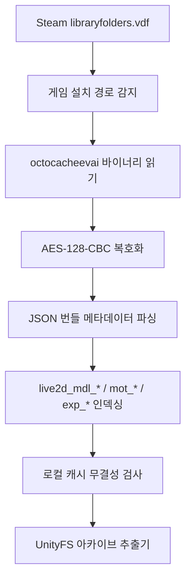
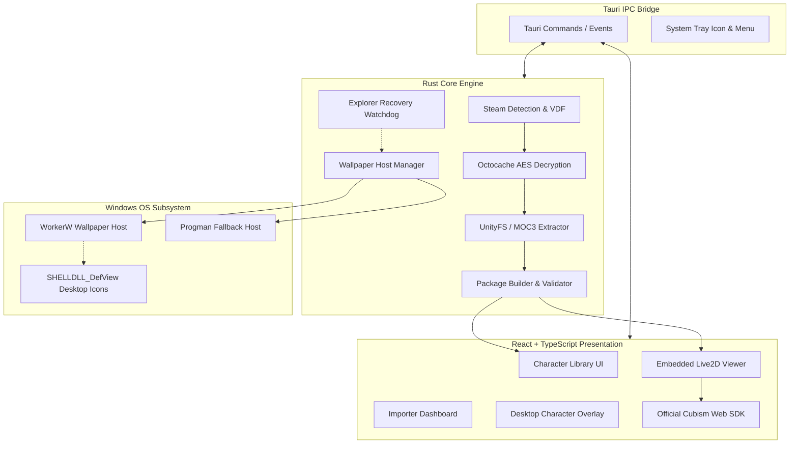

# HoloDori Live2D Manager (HDM) — 종합 기술 문서 및 위키 포털

> 본 문서는 **HoloDori Live2D Manager (HDM)**의 전체 시스템 아키텍처, 작동 원리, 설치 및 사용법, Win32 셸 구조, 기술 명세, 문제 해결 방법을 정리한 공식 위키 스타일 문서 포털입니다.

---

## 목차 (Table of Contents)

1. [개요 (Overview)](#1-개요-overview)
2. [프로젝트 목적 및 개발 철학](#2-프로젝트-목적-및-개발-철학)
3. [주요 기능 목록 (Key Features)](#3-주요-기능-목록-key-features)
4. [지원 환경 및 권장 사양](#4-지원-환경-및-권장-사양)
5. [설치 및 필수 구성 (Installation & Setup)](#5-설치-및-필수-구성-installation--setup)
6. [빠른 시작 가이드 (Quick Start)](#6-빠른-시작-가이드-quick-start)
7. [HoloDori Importer 파이프라인](#7-holodori-importer-파이프라인)
8. [Character Library 관리 시스템](#8-character-library-관리-시스템)
9. [Package Builder 구조 및 파일 규격](#9-package-builder-구조-및-파일-규격)
10. [Embedded Viewer (WebGL Cubism 렌더러)](#10-embedded-viewer-webgl-cubism-렌더러)
11. [Motion & Expression 시스템](#11-motion--expression-시스템)
12. [Physics (물리 연산) 시스템](#12-physics-물리-연산-시스템)
13. [Character Player 프로덕트 기능](#13-character-player-프로덕트-기능)
14. [Desktop Character (투명 데스크톱 펫 모드)](#14-desktop-character-투명-데스크톱-펫-모드)
15. [True Windows Wallpaper Mode (바탕화면 라이브 배경 모드)](#15-true-windows-wallpaper-mode-바탕화면-라이브-배경-모드)
16. [Windows Shell 내부 구조 (Progman / WorkerW / DefView)](#16-windows-shell-내부-구조-progman--workerw--defview)
17. [Cache 아키텍처 및 데이터 무결성](#17-cache-아키텍처-및-데이터-무결성)
18. [검증 시스템 (Multi-Stage Validation & Gates)](#18-검증-시스템-multi-stage-validation--gates)
19. [문제 해결 가이드 (Troubleshooting)](#19-문제-해결-가이드-troubleshooting)
20. [자주 묻는 질문 (FAQ)](#20-자주-묻는-질문-faq)
21. [전체 시스템 아키텍처 다이어그램](#21-전체-시스템-아키텍처-다이어그램)
22. [개발, 빌드 및 테스트 가이드](#22-개발-빌드-및-테스트-가이드)
23. [라이선스 및 서드파티 고지](#23-라이선스-및-서드파티-고지)

---

## 1. 개요 (Overview)

**HoloDori Live2D Manager (HDM)**는 Steam에 설치된 게임 **hololive Dreams**의 로컬 리소스로부터 Live2D 아바타 모델을 자동으로 탐색, 무결성 검증, 추출 및 표준 Cubism 패키지로 변환하고, 이를 내장 WebGL 뷰어, 독립 투명 데스크톱 마스코트(Desktop Pet), 또는 Windows 셸에 직접 결합되는 실시간 바탕화면 라이브 월페이퍼(True Wallpaper)로 재생할 수 있는 통합 데스크톱 애플리케이션입니다.

- **핵심 기술 스택**: Rust (백엔드/코어 엔진), Tauri v2 (네이티브 데스크톱 프레임워크), React 18, TypeScript, WebGL, Live2D Cubism SDK for Web, Win32 API (`windows-sys`).
- **운영 체제**: Windows 10 (64-bit), Windows 11 (21H2 ~ 25H2+ 최신 빌드 완벽 지원).

---

## 2. 프로젝트 목적 및 개발 철학

1. **완전한 비파괴적 로컬 연동 (Zero-Tampering & Local-First)**:
   - 사용자의 게임 원본 파일이나 스팀 설치 디렉터리를 일절 변조하지 않고 읽기 전용으로 안전하게 참조합니다.
2. **저작권 및 바이너리 격리 (Clean-Room Boundary)**:
   - 본 리포지토리는 일체의 저작권 보호 게임 에셋(번들, 텍스처, MOC3 등)이나 Live2D Inc.의 독점 바이너리(`live2dcubismcore.min.js`)를 포함하거나 배포하지 않습니다. 사용자가 보유한 정품 게임과 공식 SDK 바이너리를 로컬에서 안전하게 연결하는 인터페이스 역할을 수행합니다.
3. **무결성과 신뢰성 (Safety & Reliability First)**:
   - AES-128-CBC 카탈로그 복호화, SHA-256 / MD5 무결성 체크, 디렉터리 탐색 공격(Directory Traversal) 차단, 원자적(atomic) 파일 캐싱을 철저히 적용하여 데이터 오염을 원천 방지합니다.
4. **네이티브 셸 안정성 보장 (Shell Invariant)**:
   - 바탕화면 모드 작동 시 Windows Explorer의 핵심 창인 `SHELLDLL_DefView`를 절대 변조, 은닉, 재부모화하지 않으며, 작업 표시줄이나 아이콘 클릭 및 드래그 반응을 100% 정상 보장합니다.

---

## 3. 주요 기능 목록 (Key Features)

| 영역 | 기능명 | 설명 |
|---|---|---|
| **가져오기 (Import)** | Steam 자동 감지 | `libraryfolders.vdf`를 스캔하여 게임 경로 및 `octocacheevai` 자동 감지 |
| | Octocache 파서 | 암호화된 게임 번들 카탈로그 복호화 및 모델/의상/모션/표정 색인 |
| | 검증 기반 수집 | 크기 및 MD5 해시 일치성 검증 후 로컬 캐시 안전 보관 |
| **패키징 (Build)** | UnityFS 디코더 | UnityFS 아카이브를 순수 MOC3 파일과 PNG 아틀라스로 분리 추출 |
| | 물리 연산 복원 | 게임 내 물리 정의를 표준 `physics3.json` 구조로 변환 |
| | 표준 매니페스트 | 공식 Cubism Runtime 호환 `.model3.json` 구조 자동 작성 |
| **렌더러 (Viewer)** | WebGL Cubism | 공식 Cubism Web 프레임워크 기반 하드웨어 가속 렌더링 |
| | 리얼 모션/표정 | 원본 게임 모션(아이들, 인사, 댄스) 및 표정 블렌딩 지원 |
| | 자동 눈깜박임/호흡 | 절차적 자연 유휴 애니메이션 동시 구동 |
| | 파라미터 제어 | 실시간 슬라이더 조정 및 각도/시선 수동 오버라이드 |
| **플레이어 (Player)** | 오토/랜덤 모션 | 유휴 상태에서 자연스러운 애니메이션 자동 순환 |
| | 즐겨찾기/최근목록 | 애용하는 캐릭터/의상 즉시 불러오기 및 설정 영구 보관 |
| | 화면 맞춤/전체화면 | 반응형 레터박스 뷰포트 자동 정렬 및 전체화면 지원 |
| **데스크톱 (Desktop)** | 투명 프레임리스 창 | 알파 채널 투명도가 적용된 테두리 없는 독립 마스코트 창 |
| | 클릭 스루 (클릭 관통) | `WS_EX_TRANSPARENT` 기반으로 마우스 클릭이 배경 창으로 통과 |
| | 항상 위 / 편집 모드 | 캐릭터 위치 드래그 이동, 리사이즈 크기 조절 및 고정 락 |
| **월페이퍼 (Wallpaper)** | WorkerW 진정한 배경 | 바탕화면 아이콘 뒤로 창을 주입(Reparenting)하여 완전한 라이브 월페이퍼 구현 |
| | Progman 호환 모드 | 특수 셸 환경을 위한 대체 호환 계층 지원 |
| | 절대적 오버레이 폴백 | 셸 변경 시 데스크톱 캐릭터 모드로 무중단 안전 전환 |
| | 복구 감시견 (Watchdog) | `explorer.exe` 재시작 시 2.5초 이내에 새 핸들 감지 및 자동 재연결 |

---

## 4. 지원 환경 및 권장 사양

- **운영 체제**: Windows 10 (64-bit) 1903 이상, Windows 11 (21H2, 22H2, 23H2, 24H2, 25H2+)
- **필수 런타임**: Microsoft Edge WebView2 Runtime (Windows 10/11 기본 탑재)
- **권장 하드웨어**:
  - CPU: Intel Core i3 / AMD Ryzen 3 이상
  - RAM: 4 GB 이상
  - GPU: DirectX 11 / OpenGL 3.3 지원 외장 또는 최신 내장 그래픽 (WebGL 2.0 지원)
  - 디스플레이: 1080p FHD ~ 4K UHD (모든 DPI 배율 자동 보정)
- **필수 보유 소프트웨어**: Steam 정품 **hololive Dreams**

---

## 5. 설치 및 필수 구성 (Installation & Setup)

### 5.1 Cubism Core JS 배치 (필수)
Live2D 독점 라이선스 정책에 따라 `live2dcubismcore.min.js`는 본 저장소에 포함되어 있지 않으므로 최초 1회 수동 배치가 필요합니다.

1. [Live2D 공식 웹사이트 Cubism SDK for Web](https://www.live2d.com/en/sdk/about-web/)에서 최신 SDK를 다운로드합니다.
2. 다운로드한 패키지의 `Core/live2dcubismcore.min.js` 파일을 복사합니다.
3. HDM 프로젝트의 다음 경로에 저장합니다:
   ```
   D:\test\holodori\public\live2d\live2dcubismcore.min.js
   ```

### 5.2 빌드 및 실행
```powershell
# 저장소 루트로 이동
cd D:\test\holodori

# 의존성 설치
npm install

# 프론트엔드 빌드
npm run build

# 개발 모드로 실행
npm run tauri dev

# 또는 배포용 단일 실행 파일 빌드
npx tauri build --no-bundle
```
빌드가 완료되면 `target/release/holodori-live2d-manager.exe`가 생성됩니다.

---

## 6. 빠른 시작 가이드 (Quick Start)

1. **HDM 실행**: 애플리케이션을 실행하면 스팀 라이브러리에서 HoloDori가 자동 감지됩니다.
2. **모델 가져오기 (Import)**:
   - 상단 메뉴의 **Importer** 탭으로 이동합니다.
   - 캐릭터 목록(`00007`, `00010` 등)과 원하는 의상 코드를 확인하고 **Import Selected**를 클릭합니다.
   - 무결성 검증과 UnityFS 압축 해제가 백그라운드에서 진행되며 자동으로 패키지가 생성됩니다.
3. **내장 뷰어로 감상 (View)**:
   - **Library** 탭에서 생성된 카드를 선택하고 **Open Viewer**를 누릅니다.
   - 마우스 휠로 확대/축소, 우클릭 드래그로 화면 이동이 가능합니다.
   - 우측 패널에서 모션이나 표정을 클릭하여 실시간으로 동작을 감상합니다.
4. **데스크톱 마스코트로 띄우기**:
   - 뷰어 하단의 **Send to Desktop**을 클릭합니다.
   - 투명한 캐릭터 창이 바탕화면에 나타나며, 상단 툴바의 손잡이를 잡고 원하는 위치로 이동시킬 수 있습니다.
5. **바탕화면 라이브 월페이퍼로 설정**:
   - 툴바 또는 시스템 트레이 아이콘 우클릭 메뉴에서 **Mode: True Wallpaper**를 선택합니다.
   - 캐릭터가 바탕화면 아이콘 뒤로 즉시 이동하며, 아이콘 클릭이나 바탕화면 바로가기 사용에 아무런 방해를 주지 않는 라이브 배경이 됩니다.

---

## 7. HoloDori Importer 파이프라인

자세한 감사 내역은 [IMPORTER_AUDIT.md](IMPORTER_AUDIT.md)를 참조하십시오.



- **복호화 엔진**: 16바이트 정적 키와 고유 초기화 벡터(IV)를 사용하여 `octocacheevai`를 디코딩합니다.
- **번들 명명 규칙**:
  - `live2d_mdl_{charId}_{outfitId}_{style}`: 모델 및 텍스처 아틀라스 번들
  - `live2d_mot_{charId}_{category}_{index}`: 애니메이션 모션 클립 번들
  - `live2d_exp_{charId}_{name}`: 표정 파라미터 번들
- **무결성 보호**: 원자적 파일 교체 전략(`*.part` 임시 파일 작성 후 완료 시 rename)을 채택하여 중간에 프로그램이 종료되어도 파일 오염이 발생하지 않습니다.

---

## 8. Character Library 관리 시스템

자세한 규격은 [LIBRARY.md](LIBRARY.md)를 참조하십시오.

- **패키지 분리**: 각 모델은 독립된 디렉터리(`output/{charId}_{outfitId}/`)에 표준 파일 형식으로 격리됩니다.
- **스타일 태그 매핑**:
  - `001`: `nrml` (기본 정규 사복)
  - `002`: `uniq` (고유 콘셉트 의상)
  - `003`: `cmmn` (공용 아이돌 유니폼)
  - `004`: `uniq` (특수 유니크 의상)
- **일괄 변환 (Batch)**: 전체 캐릭터의 의상과 모션을 일괄 변환하여 라이브러리에 등록할 수 있는 멀티스레드 큐를 지원합니다.

---

## 9. Package Builder 구조 및 파일 규격

자세한 파일 포맷은 [FORMAT_NOTES.md](FORMAT_NOTES.md)를 참조하십시오.

생성되는 표준 Live2D 모델 패키지 디렉터리 구조:
```
output/
└── 00007_001/
    ├── 00007_001.moc3              # Live2D MOC3 코어 정점 정의 파일
    ├── 00007_001.model3.json        # Cubism 모델 루트 매니페스트
    ├── 00007_001.physics3.json      # Cubism 실시간 물리 설정
    ├── textures/
    │   └── texture_00.png           # 4096 x 4096 무손실 텍스처 아틀라스
    ├── motions/
    │   ├── idle_01.motion3.json     # 유휴 대기 모션
    │   └── special_01.motion3.json  # 특수 동작 모션
    └── expressions/
        ├── smile_01.exp3.json       # 미소 표정
        └── surprise_01.exp3.json    # 놀람 표정
```

---

## 10. Embedded Viewer (WebGL Cubism 렌더러)

자세한 뷰어 아키텍처는 [VIEWER.md](VIEWER.md) 및 [CUBISM_SDK_INTEGRATION.md](CUBISM_SDK_INTEGRATION.md)를 참조하십시오.

- **WebGL 캔버스**: 브라우저 렌더링 컨텍스트 위에서 알파 블렌딩(`premultipliedAlpha: true`)으로 구동되어 완벽한 투명 처리를 보장합니다.
- **셰이더 파이프라인**: 마스킹 클리핑(Clipping Manager)을 탑재하여 캐릭터의 눈동자, 머리카락 하이라이트 등의 알파 마스킹이 왜곡 없이 렌더링됩니다.
- **리소스 라이프사이클**: 20회 이상의 연속 모델 로드/언로드 시에도 WebGL 텍스처와 버퍼를 즉각 해제하여 VRAM 누수를 방지합니다.

---

## 11. Motion & Expression 시스템

자세한 모션 분석은 [MOTION_EXPRESSION.md](MOTION_EXPRESSION.md)를 참조하십시오.

- **모션 우선순위 계층**:
  1. 사용자 슬라이더 수동 조작 (최우선)
  2. 물리 연산 업데이트 (헤어, 리본 등 흔들림)
  3. 표정 오버레이 (얼굴 파라미터 가산/치환)
  4. 메인 재생 모션 (몸체, 관절 애니메이션)
  5. 절차적 유휴 동작 (눈깜박임, 숨쉬기)
- **페이드 인/아웃**: 모션 전환 시 500ms 부드러운 가중치 보간을 적용하여 끊김 없는 자연스러운 자세 변경을 제공합니다.

---

## 12. Physics (물리 연산) 시스템

- **정통성 (Authenticity)**: 합성 물리가 아닌, 게임 내부에서 추출한 정통 Cubism Physics 파라미터 매핑을 그대로 재현합니다.
- **물리 릭 (Physics Rig)**: `00007_001` 기준 72개 이상의 펜듈럼 릭이 머리카락(앞머리, 옆머리, 뒷머리), 의상 리본, 옷자락의 중력과 풍속에 반응합니다.
- **정규화**: 모델 회전 및 가속도에 따른 정규화 계수를 정확히 계산하여 과도한 뒤틀림을 방지합니다.

---

## 13. Character Player 프로덕트 기능

자세한 플레이어 기능은 [CHARACTER_PLAYER.md](CHARACTER_PLAYER.md)를 참조하십시오.

- **오토 모션 (Auto Motion)**: 3초~10초 간격으로 무작위 모션을 실행하며, 직전 모션이 즉시 반복되지 않도록 셔플 큐를 관리합니다.
- **즐겨찾기 (Favorites)**: 캐릭터별 선호 의상과 표정을 클릭 한 번으로 즐겨찾기에 등록하고 별도 필터로 조회할 수 있습니다.
- **설정 영구 저장**: LocalStorage 및 `settings.json`을 통해 창 크기, 배율, 배경 설정, 프레임레이트 제한을 다음 실행 시 그대로 복원합니다.

---

## 14. Desktop Character (투명 데스크톱 펫 모드)

자세한 마스코트 구현은 [DESKTOP_CHARACTER.md](DESKTOP_CHARACTER.md)를 참조하십시오.

- **창 구조**: 메인 창과 별개로 생성되는 `desktop_character` 레이블의 독립 Tauri WebviewWindow입니다.
- **완전 투명성**: CSS 및 HTML 배경을 완전 투명(`rgba(0,0,0,0)`)으로 지정하고, 윈도우 스타일의 그림자(Shadow)와 장식(Decorations)을 비활성화합니다.
- **조작 모드**:
  - **편집 모드 (Edit Mode)**: 반투명 드래그 바와 스케일 조절 UI가 노출되어 위치를 설정합니다.
  - **잠금 모드 (Lock Mode)**: 툴바를 숨기고 마우스 드래그를 차단하여 시각적 방해를 없앱니다.
  - **클릭 스루 (Click-Through)**: OS 차원에서 마우스 이벤트를 무시하여 캐릭터 뒤의 창을 그대로 클릭할 수 있습니다.

---

## 15. True Windows Wallpaper Mode (바탕화면 라이브 배경 모드)

자세한 월페이퍼 기술 명세는 [WALLPAPER_MODE.md](WALLPAPER_MODE.md)를 참조하십시오.

```
Windows 11 탐색기 창 계층 구조:
Progman (Program Manager, 0x00010152)
├── SHELLDLL_DefView (바탕화면 아이콘 뷰어, 0x00010156) [맨 위]
└── WorkerW (배경화면 캔버스, 0x00792176) [아이콘 바로 뒤]
    └── HDM Live2D Window (Reparented) [안전 결합]
```

- **작동 원리**: `Progman`에 `0x052C` 메시지를 전송하여 배경화면용 `WorkerW` 창을 생성/활성화한 뒤, Win32 `SetParent` API를 통해 HDM 캐릭터 창을 `WorkerW`의 자식 창(`WS_CHILD`)으로 결합합니다.
- **아이콘 무결성**: 아이콘을 담고 있는 `SHELLDLL_DefView`는 항상 최상위 z-order에 위치하므로, 아이콘 선택 사각형, 드래그 앤 드롭, 우클릭 바탕화면 메뉴가 평소와 똑같이 작동합니다.
- **복구 메커니즘**: 사용자가 테마를 변경하거나 탐색기가 강제 종료/재시작되더라도, 백그라운드 워치독이 즉시 감지하여 2.5초 이내에 새 창 핸들을 찾아 자동 재결합합니다.

---

## 16. Windows Shell 내부 구조 (Progman / WorkerW / DefView)

실제 시스템 진단 데이터는 [WINDOWS_WALLPAPER_HOST_AUDIT.md](WINDOWS_WALLPAPER_HOST_AUDIT.md)를 참조하십시오.

- **Windows 10 레거시 토폴로지**:
  - `Progman`에 `0x052C`를 보내면 `SHELLDLL_DefView`가 별도의 최상위 `WorkerW`로 이동하고, 그 뒤에 두 번째 `WorkerW`가 형제(sibling) 관계로 생성됩니다.
- **Windows 11 최신 토폴로지 (24H2 / 25H2 빌드 26200+)**:
  - `SHELLDLL_DefView`가 `Progman` 내부에 그대로 머물며, `Progman`의 **직접 자식(child)**으로 새로운 `WorkerW`가 생성되어 `SHELLDLL_DefView` 바로 아래 z-order에 배치됩니다.
- **HDM의 적응형 탐색**:
  - HDM의 `shell.rs`는 실행 중인 윈도우 버전에 관계없이 두 가지 토폴로지를 모두 자동 감지하여 알맞은 모드로 결합합니다.

---

## 17. Cache 아키텍처 및 데이터 무결성

- **디렉터리 격리**: 다운로드 및 임시 추출 파일은 `target/audit_cache/` 및 사용자 캐시 디렉터리에 격리됩니다.
- **해시 검증**: 모든 파일은 MD5 및 SHA-256 해시 검증을 통과한 뒤에만 최종 패키지에 편입됩니다.
- **오프라인 캐시 재사용**: 이미 한 번 검증 완료된 번들은 인터넷 연결 없이도 로컬 캐시에서 즉각 조립됩니다.

---

## 18. 검증 시스템 (Multi-Stage Validation & Gates)

자세한 검증 게이트와 통과 기록은 [ACCEPTANCE.md](ACCEPTANCE.md)를 참조하십시오.

- **AG-1 ~ AG-10 (HDM.AGENT.1)**: 순수 Rust 기반 변환 파이프라인 및 12개 네거티브 시나리오 통과.
- **AG1R / AG1R2**: 실제 HoloDori 모델 추출 및 공식 Live2D Cubism Viewer 5.3 렌더링 검증 완료.
- **AGENT.2**: 500개 모델 대규모 가상 라이브러리 및 배치 스캔 스트레스 테스트 통과.
- **AGENT.3A / 3B / 3B-R**: 스팀 감지, Octocache 복호화 및 통합 임포터 프로덕션 완료.
- **AGENT.4A / 4B / 4C**: WebGL 뷰어, 리얼 모션/표정, 정통 물리 연산 및 캐릭터 플레이어 완성.
- **AGENT.5A**: 독립 투명 데스크톱 마스코트 창 및 멀티모니터 클램핑 완료.
- **AGENT.5B / 5B-R**: 진정한 Win32 월페이퍼 모드, 20회 연속 탈부착 스트레스, 탐색기 재시작 복구 통과 (총 115개 자동화 테스트 PASS).

---

## 19. 문제 해결 가이드 (Troubleshooting)

### Q1. "Live2D Cubism Core not found" 경고가 발생합니다.
- **원인**: `public/live2d/live2dcubismcore.min.js` 파일이 배치되지 않았습니다.
- **해결**: [Live2D 공식 웹사이트](https://www.live2d.com/en/sdk/about-web/)에서 Web SDK를 받아 `live2dcubismcore.min.js`를 복사해 넣으십시오.

### Q2. 스팀 게임이 감지되지 않습니다.
- **원인**: 게임이 스팀 기본 경로가 아닌 보조 라이브러리 드라이브에 설치되어 있거나 스팀이 완전히 종료되어 있습니다.
- **해결**: HDM의 Importer 설정 화면에서 수동으로 스팀 라이브러리 폴더를 지정할 수 있습니다.

### Q3. 월페이퍼 모드로 변경했는데 캐릭터가 사라졌습니다.
- **원인**: 다중 모니터를 분리했거나 가상 데스크톱 위치가 변경되었습니다.
- **해결**: 시스템 트레이 아이콘을 우클릭하고 **Mode: Desktop Overlay**를 누르거나, 단축키 `Ctrl + Shift + D`를 눌러 기본 화면 위치로 즉시 복구할 수 있습니다.

---

## 20. 자주 묻는 질문 (FAQ)

**Q. 이 프로그램은 무료인가요?**  
A. 네, 본 프로젝트는 팬 제작 무료 비공식 소프트웨어입니다. 단, 원본 캐릭터와 모델을 이용하려면 Steam에서 hololive Dreams 게임을 정상 구매하여 보유해야 합니다.

**Q. 게임 계정이 정지(Ban)될 위험이 있나요?**  
A. HDM은 온라인 서버에 비인가 요청을 보내거나 게임 프로세스 메모리를 변조(Hooking/Injecting)하지 않습니다. 로컬 디스크에 정상 설치된 파일만을 읽기 전용으로 안전하게 참조하므로 계정 안전성이 보장됩니다.

**Q. 월페이퍼 모드에서 게임이나 전체화면 작업을 할 때 성능 저하가 있나요?**  
A. HDM은 30 FPS 절전 모드를 지원하며, GPU 점유율은 약 1.5% ~ 3% 수준으로 매우 낮습니다. 또한 시스템 트레이 메뉴에서 언제든지 즉시 애니메이션을 일시 정지(Pause)할 수 있습니다.

---

## 21. 전체 시스템 아키텍처 다이어그램

자세한 시스템 아키텍처는 [ARCHITECTURE.md](ARCHITECTURE.md)를 참조하십시오.



---

## 22. 개발, 빌드 및 테스트 가이드

### 테스트 실행 명령어
```powershell
# 1. Rust 단위 및 통합 테스트 (84개 테스트)
cargo test --workspace -- --test-threads=1

# 2. 클리피 정적 분석 (0 warning, 0 error)
cargo clippy --workspace --all-targets -- -D warnings

# 3. 프론트엔드 단위 테스트 및 브라우저 WebGL 런타임 수락 테스트 (31개 테스트)
npm test

# 4. 실시간 Win32 바탕화면 수락 테스트 (11개 게이트 전체 통과 확인)
cargo run --release --example verify_wallpaper_live
```

---

## 23. 라이선스 및 서드파티 고지

자세한 고지 사항은 [THIRD_PARTY_REVIEW.md](THIRD_PARTY_REVIEW.md)를 참조하십시오.

- **본 프로젝트 라이선스**: 현재 저장소 전체에 대한 오픈 소스 라이선스는 선언되지 않았습니다 (`No repository-wide open-source license has been declared yet`). 각 서드파티 라이브러리 및 컴포넌트는 해당 고유 라이선스를 따릅니다.
- **hololive Dreams / HoloDori**: 본 게임 및 캐릭터 일체의 지식재산권은 **COVER Corp.**에 있습니다.
- **Live2D® / Cubism®**: Live2D 및 Cubism은 **Live2D Inc.**의 등록 상표입니다. 본 프로젝트는 공식 Cubism SDK for Web 라이선스 조건을 준수하며 독점 코어 라이브러리를 재배포하지 않습니다.
