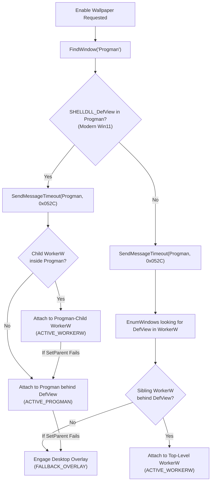

# True Windows Wallpaper Mode (HDM.AGENT.5B)

## 1. Overview

**True Windows Wallpaper Mode** enables HoloDori Live2D models to render directly upon the Windows desktop canvas beneath desktop icons and beneath open application windows.

While **Desktop Character Mode (HDM.AGENT.5A)** provides an always-available floating transparent overlay, **Wallpaper Mode (HDM.AGENT.5B)** anchors the Live2D runtime into the Windows Explorer shell window hierarchy via native Win32 window reparenting (`SetParent`).

```
+-----------------------------------------------------------------------+
|                            WINDOWS DESKTOP                            |
|                                                                       |
|  [Desktop Icons: SysListView32 / SHELLDLL_DefView] (Foreground Input) |
|                                ^                                      |
|                                | Z-order                              |
|                                v                                      |
|  [HDM Live2D Wallpaper: Webview Window] (WS_CHILD | WS_EX_TRANSPARENT)|
|                                ^                                      |
|                                | Parent                               |
|                                v                                      |
|  [Explorer Host: WorkerW or Progman]                                  |
+-----------------------------------------------------------------------+
```

---

## 2. Windows Shell Compatibility & Topology Detection

As verified in the host audit ([`docs/WINDOWS_WALLPAPER_HOST_AUDIT.md`](file:///D:/test/holodori/docs/WINDOWS_WALLPAPER_HOST_AUDIT.md)), Windows Explorer employs different window hierarchies across versions. HDM dynamically discovers and attaches to the appropriate host window:



### 2.1 Topology Classification

1. **Modern Windows 11 (24H2 / 25H2 Build 26200+)**:
   - `SHELLDLL_DefView` remains inside `Progman`.
   - Explorer creates a dedicated `WorkerW` child window directly inside `Progman` positioned immediately behind `SHELLDLL_DefView`.
   - HDM attaches to this child `WorkerW` (or directly to `Progman` behind `SHELLDLL_DefView`).
2. **Legacy Windows 10 & Early Windows 11**:
   - `0x052C` moves `SHELLDLL_DefView` into a top-level `WorkerW`.
   - A sibling top-level `WorkerW` is placed immediately behind it.
   - HDM attaches to this sibling `WorkerW`.
3. **Desktop Overlay Fallback (AGENT.5A)**:
   - If Explorer host detection fails, or if the operating system does not permit reparenting, HDM transparently falls back to Desktop Overlay mode.
   - Invariant: HDM **never reports wallpaper is active** when in fallback overlay.

---

## 3. Host State Machine

HDM manages wallpaper state with a thread-safe state machine (`WallpaperHostManager` in `src-tauri/src/desktop/wallpaper/host.rs`):

| State | Active Host | Description |
|---|---|---|
| `DISABLED` | `DesktopOverlay` | Wallpaper mode is inactive. Character runs in normal player or overlay window. |
| `DISCOVERING_HOST` | `DesktopOverlay` | Querying Progman, DefView, and WorkerW handles in the interactive desktop. |
| `ATTACHING` | `WorkerW` / `Progman` | Applying window styles (`WS_CHILD`, `WS_EX_TRANSPARENT`) and executing `SetParent`. |
| `ACTIVE_WORKERW` | `WorkerW` | True Wallpaper is active and hosted inside a `WorkerW` canvas. |
| `ACTIVE_PROGMAN` | `Progman` | True Wallpaper is active and hosted directly inside `Progman` behind desktop icons. |
| `FALLBACK_OVERLAY` | `DesktopOverlay` | Explorer host was unavailable or reparenting failed; running in infallible overlay mode. |
| `RECOVERING` | `WorkerW` / `Progman` | Watchdog detected host window invalidation and is re-attaching. |
| `ERROR` | `DesktopOverlay` | Fatal error during attachment or recovery. |

---

## 4. Strict Safety Constraints

HDM enforces rigorous boundaries to protect the host operating system:

1. **`SHELLDLL_DefView` Invariant**:
   - `SHELLDLL_DefView` is **NEVER** reparented, hidden, hooked, or modified.
   - Desktop icons remain 100% visible, responsive, and clickable.
2. **No Explorer Termination**:
   - `explorer.exe` is **NEVER** killed, restarted, or suspended by HDM.
3. **No DLL Injection or API Hooking**:
   - Wallpaper attachment uses pure, documented Win32 user32 APIs (`FindWindowExW`, `SendMessageTimeoutW`, `SetParent`, `SetWindowLongW`, `SetWindowPos`).
4. **Clean Detachment**:
   - On application shutdown or mode switch, HDM restores original window styles, unparents the window (`SetParent(hWnd, NULL)`), and safely destroys the Webview window without leaving dangling child handles inside Explorer.

---

## 5. Performance, Interactivity & Features

- **Transparent WebGL Rendering**: Live2D canvas renders with an alpha channel directly over Windows wallpaper pixels.
- **Click-Through**: Window operates with `WS_EX_TRANSPARENT` and `set_ignore_cursor_events(true)` so all mouse clicks and drags pass directly to the desktop icons underneath.
- **Full Live2D Engine Capabilities**:
  - Authentic HoloDori motions and expressions
  - Real Live2D physics evaluation
  - Procedural eye blinking and breathing
  - Auto-motion randomized playback
- **Performance Modes**:
  - **60 FPS**: Smooth motion and physics simulation.
  - **30 FPS**: Power-saving mode reducing CPU/GPU overhead.
  - **Zero-Cost Pause**: Animation loop pauses, resulting in 0 WebGL draws and near-zero CPU usage.
- **Multi-Monitor Placement**: Window boundaries are clamped and DPI-scaled across primary and secondary displays.

---

## 6. Host Recovery Watchdog

When Explorer restarts (e.g. after a shell crash or user logoff), the previous `WorkerW` and `Progman` HWNDs become invalid.

HDM runs a dedicated background watchdog (`WallpaperWatchdog` in `src-tauri/src/desktop/wallpaper/recovery.rs`):
1. Polls host window validity every 2.5 seconds using `IsWindow(hHost)`.
2. If the host HWND is destroyed:
   - Emits `wallpaper-host-invalidated` event.
   - Enters `RECOVERING` state.
   - Re-runs host discovery to acquire new Explorer handles.
   - If Explorer has restarted, reattaches automatically.
   - If Explorer is unresponsive, seamlessly transitions to `FALLBACK_OVERLAY` to ensure uninterrupted display.

---

## 7. Configuration & Settings Schema

Wallpaper configuration is integrated into `PlayerSettings`:

```typescript
export interface WallpaperSettings {
  enabled: boolean;
  preference: 'auto' | 'worker_w' | 'progman' | 'desktop_overlay';
  fallbackEnabled: boolean;
  autoRecover: boolean;
  monitorMode: 'primary' | 'all' | 'custom';
  selectedMonitor?: string;
  targetFps: 30 | 60;
}
```

Settings are persisted atomically via Tauri IPC and localStorage, with automatic migration for legacy state configurations.
